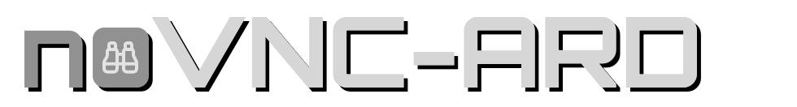

<p></p>

ARD protocol extensions for [noVNC](https://github.com/novnc/noVNC).

A browser-based client for macOS Screen Sharing (protocol version `003.889`). All ARD-specific code lives in a standalone monkey-patch layer on top of an untouched upstream noVNC git submodule. Standard VNC connections pass through unmodified.

## Features

**Authentication**
- Type 30 (Diffie-Hellman) and Type 33 (RSATunnel) credential exchange
- Keystroke encryption (AES-128-ECB) for individual key events
- Full tunnel encryption (AES-128-CBC + SHA-1 integrity)

**Session Management**
- Session Select dialog (share console or connect to virtual display)
- Auto-reconnect with exponential backoff
- Control modes: observe, shared, exclusive

**UI Controls**
- Quality slider with 4 presets (halftone, gray, thousands, millions)
- Clipboard sync, send, and receive
- Curtain screen lock with custom message
- Remote user avatar display
- Mac modifier key labels (Cmd, Opt)
- Connection info panel

**Pixel Decoders**
- Halftone (encoding 1000) — 1-bit black/white, zlib-compressed
- Gray16 (encoding 1001) — 4-bit 16 grays, zlib-compressed
- Thousands (encoding 1002) — 16-bit RGB555, zlib-compressed

**Keyboard**
- Double-backtick shortcut for full screen refresh

## Quick Start

```bash
# Clone with submodule
git clone --recurse-submodules https://github.com/peetinc/noVNC-ARD.git

# Proxy a macOS Screen Sharing server through websockify
websockify --web . 6088 <host>:5900

# Open in browser
open http://localhost:6088/ard.html
```

## URL Parameters

| Parameter | Type | Default | Description |
|-----------|------|---------|-------------|
| `theme` | string | `novnc` | UI theme: `novnc`, `novnc-ard`, `noard` |
| `ardQuality` | string | `thousands` | Initial quality preset: `halftone`, `gray`, `thousands`, `millions` |
| `ardEncryption` | integer | `2` | Encryption mode: `1` = keystroke-only, `2` = full tunnel |
| `ardControlMode` | integer | `1` | Control mode: `0` = observe, `1` = shared, `2` = exclusive |
| `virtualLogin` | integer | `1` | Session select: `0` = always share, `1` = show picker, `2` = always virtual |
| `ardAutoSelectDisplay` | boolean | `true` | Automatically select display configuration |
| `showArdUserAvatar` | boolean | `true` | Show remote user avatar in sidebar |
| `showArdClipboard` | boolean | `true` | Show clipboard buttons |
| `showArdScreenLock` | boolean | `true` | Show curtain lock button |
| `showArdQuality` | boolean | `true` | Show quality selector |
| `showArdDisplaySelect` | boolean | `true` | Show display selector |

## Public API

### Methods

| Method | Description |
|--------|-------------|
| `forceClipboardPaste(text)` | Send local clipboard text to remote |
| `requestRemoteClipboard()` | Request clipboard contents from remote server |
| `enableClipboardSync(enabled)` | Enable or disable automatic clipboard sync |
| `ardCurtainLock(message?)` | Lock remote screen with optional message |
| `ardCurtainUnlock()` | Unlock remote screen |
| `requestFullUpdate()` | Request full framebuffer update |
| `selectSessionType(command)` | Resume session select: `1` = console, `2` = virtual display |

### Properties

| Property | Type | Access | Description |
|----------|------|--------|-------------|
| `ardControlMode` | integer | read/write | `0` = observe, `1` = shared, `2` = exclusive |
| `ardQualityPreset` | string | read/write | `halftone`, `gray`, `thousands`, `millions` |
| `ardCurtainActive` | boolean | read-only | Whether remote screen is curtain-locked |

### Events

| Event | Detail | Description |
|-------|--------|-------------|
| `ardsessionselect` | `{ username, allowedCommands, hasConsoleUser }` | Server requests session type selection |
| `arduserinfo` | `{ username, hasAvatar }` | Remote user info received |
| `ardcurtainchange` | `{ active }` | Curtain lock state changed |
| `ardencryptionstate` | `{ state }` | Session encryption activated |

## Quality Presets

| Preset | Encoding List | Pixel Depth |
|--------|--------------|-------------|
| `halftone` | ArdHalftone, ZRLE, Zlib, Raw | 1-bit (black/white) |
| `gray` | ArdGray16, ZRLE, Zlib, Raw | 4-bit (16 grays) |
| `thousands` | ArdThousands, ZRLE, Zlib, Raw | 16-bit (RGB555) |
| `millions` | ZRLE, Zlib, Raw | 24-bit (full color) |

All presets include standard fallback encodings (CopyRect, Hextile, RRE) and ARD pseudo-encodings (CursorPos, DisplayInfo, UserInfo, SessionEncryption, CursorAlpha, DisplayInfo2, DeviceInfo, KeyboardInput).

## Project Structure

```
noVNC-ARD/
  noVNC/                        git submodule (upstream, untouched)
  ard/
    ard-constants.js            encoding IDs, message types, status codes
    ard-patch.js                monkey-patches RFB prototype for ARD support
    crypto/
      aes128.js                 AES-128 (ECB + CBC modes)
      sha1.js                   SHA-1 hash
      pkcs1.js                  PKCS#1 DER public key parser
    decoders/
      zlib-halftone.js          1-bit halftone decoder (encoding 1000)
      zlib-16gray.js            4-bit gray decoder (encoding 1001)
      zlib-thousands.js         16-bit RGB555 decoder (encoding 1002)
    images/
      binoculars.svg            Observe mode icon (Lucide, ISC)
      cmd.svg                   Mac Command key icon (Lucide, ISC)
      disconnect.svg            Disconnect icon (Lucide, ISC)
      opt.svg                   Mac Option key icon (Lucide, ISC)
      quality.svg               Quality selector icon (Lucide, ISC)
      quality-high.svg          High quality indicator (Lucide, ISC)
      quality-low.svg           Low quality indicator
      user.svg                  Default user avatar (Lucide, ISC)
    tests/
      test.crypto.js            AES, SHA-1, PKCS#1 tests (FIPS/NIST vectors)
      test.wire.js              ARD wire format and message builder tests
  ard.html                      entry point (loads noVNC + ARD patch)
  ard.css                       ARD-specific styles
```

## Testing

Tests use Node.js built-in test runner (`node:test`):

```bash
# Run all tests
node --test ard/tests/test.crypto.js ard/tests/test.wire.js

# Run individually
node --test ard/tests/test.crypto.js   # crypto primitives
node --test ard/tests/test.wire.js     # wire format + message builders
```

Crypto tests validate against FIPS 197 and NIST test vectors. Wire tests cover ARD message byte patterns, session select event dispatch, and state machine transitions.

## Architecture

The patch is organized in two layers:

**Layer 1 — Protocol Scaffolding**
Detection (`003.889` version string), Apple-extended ClientInit (`0xC1`), Extended ServerInit parsing, ARD message dispatch, encoding negotiation, and 0x0 framebuffer guard.

**Layer 2 — Features**
- *Auth & Encryption:* Type 30 DH, Type 33 RSATunnel, EncryptedEvent (keystroke AES-128-ECB), full session encryption (AES-128-CBC + SHA-1)
- *Session:* Session Select sub-protocol, clipboard sync/send/receive, curtain screen lock, control mode switching, remote user avatar, quality preset switching
- *Pixel Decoders:* Zlib-compressed ARD formats converted to RGBA for canvas

**Crypto Primitives**
Pure JavaScript — AES-128, SHA-1, PKCS#1 DER parsing. No external dependencies.

## License

This project is licensed under the [Mozilla Public License 2.0](LICENSE).

**Upstream noVNC** is licensed under [MPL 2.0](https://github.com/novnc/noVNC/blob/master/LICENSE.txt) and lives in the `noVNC/` submodule with its own license file.

**Lucide icons** are licensed under the [ISC License](https://github.com/lucide-icons/lucide/blob/main/LICENSE) (Copyright Lucide Contributors): `binoculars.svg`, `cmd.svg`, `disconnect.svg`, `opt.svg`, `quality.svg`, `quality-high.svg`, `user.svg`.

Remaining SVG icons in `ard/images/` (`quality-low.svg`) are original work covered by this project's MPL 2.0 license.
